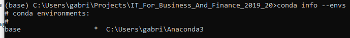
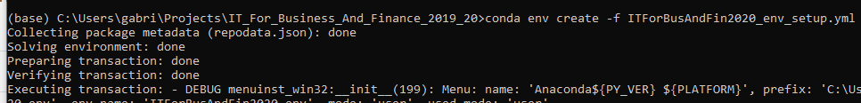
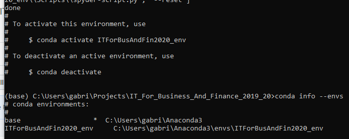
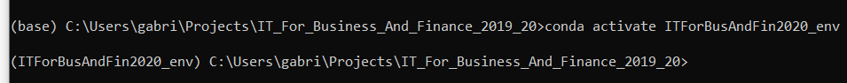

# IT For Business and Finance 2019/20

This repository (https://github.com/gabrielepompa88/IT-For-Business-And-Finance-2019-20) provides course informations and material supporting the first year master course of _IT For Business and Finance_ held at University of Siena in 2019/20.

**WARNING**: the course and this repository is under ongoing update.

# Table of contents
- [Class Schedule](#class_schedule)
- [Contacts](#contacts)
- [Class Diary](#class_diary)
- [Resources](#resources)
  - [Reading](#reading_material)
  - [Programming](#programming_material)
- [Setup](#setup)
  - [Working directory](#working_directory)
  - [Conda environment](#conda_environment)

## Class Schedule 
Classes start on Monday, February 24 2020 at 14:00 in _Aula informatica 1_. The timetable is:

Monday: 14:00-16:00\
Tuesday: 18:00-19:30\
Wednesday: 14:00-16:00

Currently known amendements to this schedule are the following:

Monday 16/3: _Aula 1_\
Wednesday 4/3 and 18/3: _Aula 11_

## Contacts 
[Gabriele Pompa](https://www.linkedin.com/in/gabrielepompa/) (gabriele.pompa@gmail.com)

## Class Diary 
This is the diary of the class. Here the topics covered during the lessons are listed, as well as the corresponding [Python for Finance (2nd ed.)](http://shop.oreilly.com/product/0636920117728.do) textbook chapters and other learning material (e.g. Jupyter Notebooks).

- **Lesson 1 (24/02)**: class presentation, introduction to: programming in Python, Anaconda platform, Jupyter Notebooks and interactive programming, Spyder IDE and programmatic programming, Python modules and `import` expressions.
  - Sections _The Python Programming Language_, _Technology in Finance_
  - [Introduction.ipynb](code/Introduction.ipynb)
- **Lesson 2 (25/02)**:  motivations for adopting Python in Finance.
  - Sec. _Python for Finance_, _Data-Driven Finance_, _Basic operations with conda_, _Conda as a Virtual Environment Manager_
  - ciao

## Resources 

### Reading 
- Textbook: [_Python for Finance -- Mastering Data-Driven Finance_ (2nd edition)](http://shop.oreilly.com/product/0636920117728.do) by Yves Hilpisch (O'Reilly). 

- Online tutorial: [Python 3.7 online tutorial](https://docs.python.org/3.7/tutorial/).

- Other useful resources online: [Beginner's Guide To Python](https://wiki.python.org/moin/BeginnersGuide).

- Tutorial from [Guido van Rossum](https://it.wikipedia.org/wiki/Guido_van_Rossum) (Python's first developer): [Python Tutorial Release 3.7.0 (September 02, 2018)](https://bugs.python.org/file47781/Tutorial_EDIT.pdf).

### Programming 
- [Anaconda](https://www.anaconda.com/) platform 
is a free and open-source distribution of the Python and R programming languages for scientific computing (data science, machine learning applications, large-scale data processing, predictive analytics, etc.), that aims to simplify package management and deployment. Package versions are managed by the package management system `conda` The Anaconda distribution includes data-science packages suitable for Windows, Linux, and MacOS (quoting [wikipedia](https://en.wikipedia.org/wiki/Anaconda_(Python_distribution)) page)

  Tips: 
  
   - [How to manage Conda environments](https://docs.conda.io/projects/conda/en/latest/user-guide/tasks/manage-environments.html)
   - [Conda cheat sheet](https://docs.conda.io/projects/conda/en/4.6.0/_downloads/52a95608c49671267e40c689e0bc00ca/conda-cheatsheet.pdf)

- [Jupyter](https://jupyter.org/) Notebooks  
(included in Anaconda distribution) is a web-based interactive computational environment for creating Jupyter notebook documents (quoting [wikipedia](https://en.wikipedia.org/wiki/Project_Jupyter#Jupyter_Notebook) page)

  Tips:

    - [Jupyter Notebooks cheat sheet](https://cheatography.com/weidadeyue/cheat-sheets/jupyter-notebook/pdf_bw/)

- [Spyder](https://www.spyder-ide.org/) IDE  
(also shipped with Anaconda distribution) is an open source integrated development environment (IDE) for scientific programming in the Python language (quoting [wikipedia](https://en.wikipedia.org/wiki/Spyder_(software)) page)

## Setup 

### Working directory 
Follow these instructions to setup the working directory _IT-For-Business-And-Finance-2019-20_ with all the course material.

a. If you are familiar with [github](https://github.com/), that's great _you are a boss!_, follow these steps:

  0. Step into a directory where you want your local copy of the [IT-For-Business-And-Finance-2019-20](https://github.com/gabrielepompa88/IT-For-Business-And-Finance-2019-20) remote repo to be created;
  
  1. clone the course repo into your current directory typing: `git clone https://github.com/gabrielepompa88/IT-For-Business-And-Finance-2019-20.git`. A local folder named _IT-For-Business-And-Finance-2019-20_ will be created, which includes all the contents of the remote repository (as they will be at that point in time);
  
  2. To update your local copy of the remote branch with the updates I will make to the remote repo (e.g. new material uploaded), simply `git pull` into your local copy folder. **WARNING: doing this way you may have conflicts, so be prepared to manage them, otherwise go for option _b._**

b. If not, no panic _Rome wasn't built in a day_, follow these steps: 

  0. Download the remote repo as a ZIP folder into your local machine (see picture)
  
  
  1. Un-zip the _IT-For-Business-And-Finance-2019-20_ folder, which includes all the contents of the remote repository (as they will be at that point in time);
  
  2. To update your local copy of the remote branch with the updates I will make to the remote repo (e.g. new material uploaded), you can repeate steps _0._ and _1._, creating each time a brand new local folder or:
  
     2.0. locate the new/updated files in the remote repo;
  
     2.1. push the _Raw_ button on the top-right corner of the file (see picture)
     
     
  
     2.2. Save it from browser into your local machine. **WARNING: respect the original folder/sub-folder structure**. 

### Conda environment 
In the course folder _IT-For-Business-And-Finance-2019-20_ there is an environment setup file _ITForBusAndFin2020_env_setup.yml_ from which the dedicated _ITForBusAndFin2020_env_ Conda environment can be created. This new conda environment contains all the packages needed for the course. Follow these steps to create and activate it:

0. Open your conda navigator and locate the _Anaconda Prompt_ (that is, a terminal shell). Press the _console_shortcut_ button to open it (see picture)

1. Move to the course directory typing `cd $DIRECTORY_PATH` where `$DIRECTORY_PATH` has to be substituted with the path to the course directory _IT-For-Business-And-Finance-2019-20_ folder (something like _C:\\...\\IT-For-Business-And-Finance-2019-20_)

2. Type `conda info --envs` to list the installed environments. There should be at least one environment, named `base`. There could be more, that's not a problem (see picture). 

3. If, as in picture above, you see a star  symbol `*` on the right of the `base` environment name, go to point 3. If not, type `conda activate base` to activate the base environment.

4. From your _base_ environment (identifyied by the `(base)` at the beginning of the prompt, see picture), type `conda env create -f ITForBusAndFin2020_env_setup.yml`, which creates the _ITForBusAndFin2020_env_ from the _ITForBusAndFin2020_env_setup.yml_ file (see picture)

5. Once the installation is completed, you can verify that the environment has been succesfully created typing `conda info --envs`. At least two environments should be listed: `base` and `ITForBusAndFin2020_env`. Notice the `*`: the active environment is still the `base` one (see picture)

6. Activate our brand new course environment typing `conda activate ITForBusFin2020_env`. Notice how the prompt changes to include `(ITForBusAndFin2020_env)` (see picture)

7. To see the list of installed packages in the course environment you can type `conda list` (see picture). 

In particular you should see the following packages installed, which we will extensively use:

    Python 3.7.4
    Numpy 1.16.5
    Scipy 1.3.1
    Pandas 0.25.1
    Matplotlib 3.1.1
    
