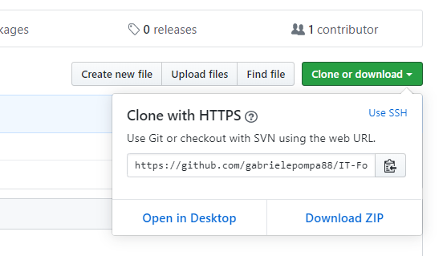
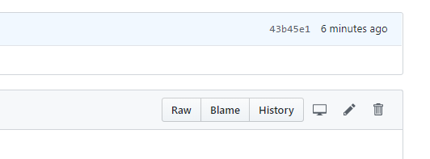

# IT For Business and Finance 2019/20

This repository (https://github.com/gabrielepompa88/IT-For-Business-And-Finance-2019-20) provides course informations and material supporting the first year master course of _IT For Business and Finance_ held at University of Siena in 2019/20.

## Course logistics
Classes start on Monday, February 24 2020 at 14:00 in _Aula informatica 1_. The timetable is:

Monday: 14:00-16:00\
Tuesday: 18:00-19:30\
Wednesday: 14:00-16:00

Currently known emendements to this schedule are the following:

Monday 16/3: _Aula 1_\
Wednesday 4/3 and 18/3: _Aula 11_

## Contacts
By appointment (gabriele.pompa@gmail.com)

## Resources

#### Reading material
- Textbook: _Python for Finance -- Mastering Data-Driven Finance_ (2nd edition) by Yves Hilpisch (O'Reilly). 

- Other useful resources online: [Beginner's Guide To Python](https://wiki.python.org/moin/BeginnersGuide)

- Tutorial from [Guido van Rossum](https://it.wikipedia.org/wiki/Guido_van_Rossum) (Python's first developer): [Python Tutorial Release 3.7.0 (September 02, 2018)](https://bugs.python.org/file47781/Tutorial_EDIT.pdf)

#### Programming material
- [Anaconda](https://www.anaconda.com/) platform 
is a free and open-source distribution of the Python and R programming languages for scientific computing (data science, machine learning applications, large-scale data processing, predictive analytics, etc.), that aims to simplify package management and deployment. Package versions are managed by the package management system `conda` The Anaconda distribution includes data-science packages suitable for Windows, Linux, and MacOS (quoting [wikipedia](https://en.wikipedia.org/wiki/Anaconda_(Python_distribution)) page)

- [Jupyter](https://jupyter.org/) Notebooks  
(included in Anaconda distribution) is a web-based interactive computational environment for creating Jupyter notebook documents (quoting [wikipedia](https://en.wikipedia.org/wiki/Project_Jupyter#Jupyter_Notebook) page)

- [Spyder](https://www.spyder-ide.org/) IDE  
(also shipped with Anaconda distribution) is an open source integrated development environment (IDE) for scientific programming in the Python language (quoting [wikipedia](https://en.wikipedia.org/wiki/Spyder_(software)) page)

## Setup [TO BE COMPLETED]
### Course working directory setup
a. If you are familiar with [github](https://github.com/), that's great _you are a boss!_, follow these steps:

  0. Step into a directory where you want your local copy of the [IT-For-Business-And-Finance-2019-20](https://github.com/gabrielepompa88/IT-For-Business-And-Finance-2019-20) remote repo to be created;
  
  1. clone the course repo into your current directory typing: `git clone https://github.com/gabrielepompa88/IT-For-Business-And-Finance-2019-20.git`. A local folder named _IT-For-Business-And-Finance-2019-20_ will be created, which includes all the contents of the remote repository (as they will be at that point in time);
  
  2. To update your local copy of the remote branch with the updates I will make to the remote repo (e.g. new material uploaded), simply `git pull` into your local copy folder. **WARNING: doing this way you may have conflicts, so be prepared to manage them, otherwise go for option _b._**

b. If not, no panic _Rome wasn't built in a day_, follow these steps: 

  0. Download the remote repo as a ZIP folder into your local machine (see picture)
  
  
  1. Un-zip the _IT-For-Business-And-Finance-2019-20_ folder, which includes all the contents of the remote repository (as they will be at that point in time);
  
  2. To update your local copy of the remote branch with the updates I will make to the remote repo (e.g. new material uploaded), you can repeate steps _0._ and _1._, creating each time a brand new local folder or:
    2.1 locate the new/updated files in the remote repo  
    2.2 push the _Raw_ button on the top-right corner of the file (see picture)
    
    2.3 Save it from browser into your local machine, respecting the folder/sub-folder structure. 
    
