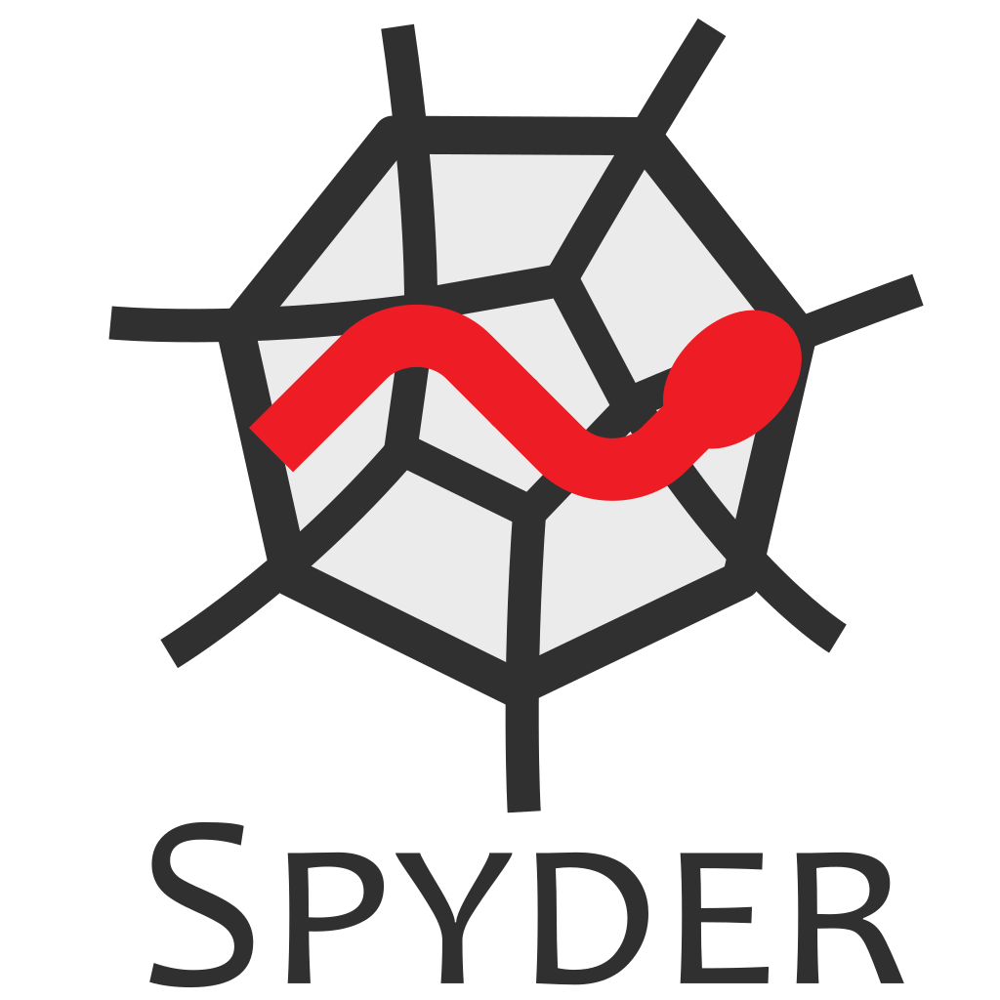

# IT For Business and Finance 2019/20

This repository (https://github.com/gabrielepompa88/IT-For-Business-And-Finance-2019-20) provides course informations and material supporting the first year master course of _IT For Business and Finance_ held at University of Siena in 2019/20.

**WARNING**: the course and this repository is under ongoing update.

---

**Symbols conventions**: updated sections/material in this README.md file will be highlited with &#x1F534; (a big red circle) displayed next to it.

- **Objectives**: To acquire practice in the use of financial models through Python programming language
- **Contents**: IT tools for modeling in Finance; Python
- **Teaching Methods**: Lessons in IT lab
- **Verification of learning**: written exam
- **Learning Material**:
  - Textbook: [Python for Finance, 2nd Edition](http://shop.oreilly.com/product/0636920117728.do), by Yves Hilpisch (O’Reilly). Copyright 2019 Yves Hilpisch, 978-1-492-02433-0.
  - All the reading and programming resources are listed in the class github repository: [IT-For-Business-And-Finance-2019-20](https://github.com/gabrielepompa88/IT-For-Business-And-Finance-2019-20#resources)

---

# Table of contents
- [IMPORTANT COMMUNICATIONS](#bakeka)
- [Class Schedule](#class_schedule)
- [Contacts](#contacts)
- [Class Diary](#class_diary)
- [Resources](#resources)
  - [Reading](#reading_material)
  - [Programming](#programming_material)
- [Setup](#setup)
  - [How to work IN CLASS](#class)
    - [Before the lessons starts](#before_class)
    - [How to follow the lesson](#during_class)
  - [How to work AT HOME](#home)
    - [First-time SETUP](#home_setup)
    - [How to work at home](#wfh)

---

# IMPORTANT COMMUNICATIONS <a name="bakeka"></a> 
&#x1F534; The e-learning for IT for Business and Finance course at [http://elearning.unisi.it/moodle/](http://elearning.unisi.it/moodle/) (more info to come) is now active. You can access with your unisiPass credentials at [http://elearning.unisi.it/moodle/](http://elearning.unisi.it/moodle/) and type "IT pompa" in the "Cerca Corso" search window (top right corner of screen). E-learning material is under ongoing production and addition.

---

# Class Schedule <a name="class_schedule"></a> 
Classes start on Monday, February 24 2020 at 14:00 in _Aula informatica 1_. The timetable is:

Monday: 14:00-16:00\
Tuesday: 18:00-19:30 **this lesson starts sharply at 18:00**\
Wednesday: 14:00-16:00

Currently known amendements to this schedule are the following:

Monday 16/3: _Aula 1_\
Wednesday 4/3 and 18/3: _Aula 12_ 

---

# Contacts <a name="contacts"></a>
[Gabriele Pompa](https://www.linkedin.com/in/gabrielepompa/) (gabriele.pompa@unisi.it)

---

# Class Diary <a name="class_diary"></a>
This is the diary of the class. Here the topics covered during the lessons are listed, as well as the corresponding reading material.

**Conventions for reading material**: sections from 
- the TextBook [Python for Finance (2nd ed.)](http://shop.oreilly.com/product/0636920117728.do) are labelled as _TB.ChapterNumber.SectionName_ to refer to a whole Section  (e.g. _TB.1.The Python Programming Language_) or as _TB.ChapterNumber.SubSectionName_ to refer to a particular sub-Section (e.g. _TB.1.Data-Driven Finance_ ).

- the [Python Tutorial](https://docs.python.org/3.7/tutorial/) are labelled as _PyT.SectionNumber.SubSectionNumber.SubSubSectionNumber_ (SubSubSectionName)_ (e.g.: section 3.1.2 on [Strings](https://docs.python.org/3.7/tutorial/introduction.html#strings) is labelled _PyT.3.1.2 (Strings)_ ).

- the [Numpy Quickstart Tutorial](https://docs.scipy.org/doc/numpy/user/quickstart.html#quickstart-tutorial) are labelled as _Numpy Quickstart Tutorial - SectionName_ (list of SubSections).

- the [Pandas - Getting started tutorials](https://pandas.pydata.org/docs/getting_started/intro_tutorials/index.html) are mentioned by section name (e.g.: [What kind of data does pandas handle?](https://pandas.pydata.org/docs/getting_started/intro_tutorials/01_table_oriented.html)).

Below the list of lessons with relevant related material:

- **Lesson 1 (24/02)**: class presentation. introduction to: programming in Python, Anaconda platform, Jupyter Notebooks and interactive programming, Spyder IDE and programmatic programming, Python modules and `import` expressions.
  - _TB.1.The Python Programming Language_, _TB.1.Technology in Finance._
  - Lecture Notes **Introduction I** [.ipynb](Notebooks/Introduction_I.ipynb) | [.pdf](Notebooks/Printable/Introduction_I.pdf).
  
- **Lesson 2 (25/02)**:  motivations for adopting Python in Finance.
  - _TB.1.Python for Finance_, _TB.1.Data-Driven Finance_, _TB.2.Basic Operations with conda_, _TB.2.conda as a Virtual Environment Manager._ 
  
- **Lesson 3 (26/02)**:  random number generation. Histogram. Empirical distribution (normalized histogram). Template for `.py` files (scripts) in Spyder.
  - Spyder Template file [template_example.py](Scripts/template_example.py): use this file as a template example. Any script (`.py` file) that you write in Spyder IDE has to follow the structure of this template.
  - Lecture Notes **Introduction II** [.ipynb](Notebooks/Introduction_II.ipynb) | [.pdf](Notebooks/Printable/Introduction_II.pdf): Sec. 1, 2, 3.
  
- **Lesson 4 (2/03)**:  `int` data type, `.bit_length()` method for `int`, binary representation of integers (examples). `float` data type, issues of finite precision of internal binary representation of decimal numbers, arbitrary precision in Python ([`Decimal` module](https://docs.python.org/2/library/decimal.html)). Normal random variables in Python (Scipy [`norm` class](https://docs.scipy.org/doc/scipy/reference/generated/scipy.stats.norm.html)),`.pdf()` method of `norm` class, Normal fit to empirical distribution, `.fit()` method of `norm` class.
  - _TB.3.Integers_, _TB.3.Floats._
  - Lecture Notes **Introduction II** [.ipynb](Notebooks/Introduction_II.ipynb) | [.pdf](Notebooks/Printable/Introduction_II.pdf):: Sec. 4.
  - Lecture Notes **Basics_I___Data_Types** [.ipynb](Notebooks/Basics_I___Data_Types.ipynb) | [.pdf](Notebooks/Printable/Basics_I___Data_Types.pdf): Sec. 1 and 2.
  
- **&mu;&epsilon;&tau;&alpha;-Lesson 5 (3/03)**: gentle introduction to [github](https://github.com/). Teacher-Student(s) workflow (push-pull flow). Edit - Stage (`git add`) - Commit (`git commit`) pattern. Setup of a local development clone of a repository already established (hands-on example: `git clone` of the class repository into computers of _Aula Informatica 1_). Syncing local clone with updated class repository (the _hard_ way) with `git fetch` and `git reset`.   
  
- **Lesson 6 (4/03)**:  how to work this class, class/home study work-flow, how to take notes in class and at home (the `Personal_Notes` personal folder). Random number generation: Normal fit of a distribution, higher moments of a distribution (Skewness and Kurtosis), sample skewness and kurtosis, Jarque-Bera test of Normality, null-hypothesis and use of p-value of a test for decision-making.
  - [How To Work This Class](https://github.com/gabrielepompa88/IT-For-Business-And-Finance-2019-20/blob/master/How-to-work-this-class.md) tutorial.
  - Lecture Notes **Introduction II** [.ipynb](Notebooks/Introduction_II.ipynb) | [.pdf](Notebooks/Printable/Introduction_II.pdf):: Sec. 5 and 6.
  
- **Lesson 7 (9/03)**:  introduction to the e-learning platform [moodle](http://elearning.unisi.it/moodle/enrol/index.php?id=3326). `bool` data type, `while` loop, `if` statement. `str` data type (definition, indexing, slicing).
  - _TB.3.Basic Data Types_ (_TB.3.Excursion: Regular Expression_ is optional reading).
  - _[PyT.3.1.1](https://docs.python.org/3.7/tutorial/introduction.html#numbers) (Numbers),_ _[PyT.3.1.2](https://docs.python.org/3.7/tutorial/introduction.html#strings) (Strings),_ _[PyT.3.2](https://docs.python.org/3.7/tutorial/introduction.html#first-steps-towards-programming) (First Steps Toward Programming),_ _[PyT.4.1](https://docs.python.org/3.7/tutorial/controlflow.html#if-statements) (if Statements)._
  - Lecture Notes **Basics_I___Data_Types** [.ipynb](Notebooks/Basics_I___Data_Types.ipynb) | [.pdf](Notebooks/Printable/Basics_I___Data_Types.pdf): Sec. 3 and 4.
  - Videos: 
    - [e-learning general notes](https://usienalecture.unisi.it/Panopto/Pages/Viewer.aspx?id=de00b000-b76f-4800-8924-ab7900d00dbb), 
    - [7.1 - First-time setup of your personal computer](https://usienalecture.unisi.it/Panopto/Pages/Viewer.aspx?id=1d42d2b3-487f-4a33-9ca8-ab79010e7811), 
    - [7.2 - How to work at home](https://usienalecture.unisi.it/Panopto/Pages/Viewer.aspx?id=1939668b-6a18-4598-8bf8-ab7901123a1b),
    - [7.3 - How to use the Personal_Notes folder](https://usienalecture.unisi.it/Panopto/Pages/Viewer.aspx?id=5912c8d1-3de6-4e90-bd99-ab7901251684) 
    - [7.4 - Data Types - Introduction](https://usienalecture.unisi.it/Panopto/Pages/Viewer.aspx?id=b256346b-3c9a-4a51-b817-ab7b00f65a3b)
    - [7.5 - Data Types - Integers](https://usienalecture.unisi.it/Panopto/Pages/Viewer.aspx?id=d18902c4-4c3f-4c81-9ab5-ab7b00f797cb)
    - [7.6 - Data Types - Floats](https://usienalecture.unisi.it/Panopto/Pages/Viewer.aspx?id=2cd94b38-5f2b-4606-9266-ab7b00f87c6b)
    - [7.7 - Data Types - Booleans](https://usienalecture.unisi.it/Panopto/Pages/Viewer.aspx?id=ba3900d3-038a-45fb-b824-ab7b00fb073c)
    - [7.8 - Data Types - Strings](https://usienalecture.unisi.it/Panopto/Pages/Viewer.aspx?id=0cecc809-a544-441e-9ed0-ab7b00fea710)

- **Lesson 8 (10/03)**:  introduction to data-structures in Python, `tuple` data structure, `list` data structure, `for` loop, `dict` data structure, `set` data structure.
  - _TB.3.Basic Data Structures_ (_TB.3.Excursus: Functional Programming_ is optional reading).
  - _[PyT.3.1.3](https://docs.python.org/3.7/tutorial/introduction.html#lists) (Lists),_ _[PyT.4.2](https://docs.python.org/3.7/tutorial/controlflow.html#for-statements) (for Statements),_ _[PyT.4.3](https://docs.python.org/3.7/tutorial/controlflow.html#the-range-function) (The range() Function),_ _[PyT.4.4](https://docs.python.org/3.7/tutorial/controlflow.html#break-and-continue-statements-and-else-clauses-on-loops) (break and continue Statemenents, and else Clauses on Loops),_ _[PyT.5.1](https://docs.python.org/3.7/tutorial/datastructures.html#more-on-lists) (More on Lists),_ _[PyT.5.3](https://docs.python.org/3.7/tutorial/datastructures.html#tuples-and-sequences) (Tuples and Sequences),_ _[PyT.5.4](https://docs.python.org/3.7/tutorial/datastructures.html#sets) (Sets),_ _[PyT.5.5](https://docs.python.org/3.7/tutorial/datastructures.html#dictionaries) (Dictionaries)._
  - Lecture Notes **Basics_II___Data_Structures** [.ipynb](Notebooks/Basics_II___Data_Structures.ipynb) | [.pdf](Notebooks/Printable/Basics_II___Data_Structures.pdf)
  - Videos: 
    - [8.1 - Data Structures - Introduction](https://usienalecture.unisi.it/Panopto/Pages/Viewer.aspx?id=76dcef60-d997-4212-a2f5-ab7d011cb8c1)
    - [8.2 - Data Structures - Tuples](https://usienalecture.unisi.it/Panopto/Pages/Viewer.aspx?id=fa8a9803-4cab-418e-becd-ab7d011f4e80)
    - [8.3 - Data Structures - Lists](https://usienalecture.unisi.it/Panopto/Pages/Viewer.aspx?id=80278d24-dde8-47e5-9c30-ab7d0121775b)
    - [8.4 - Data Structures - Nested Tuples](https://usienalecture.unisi.it/Panopto/Pages/Viewer.aspx?id=e4c5d6cd-b91b-4ae7-9271-ab7d012aa332)
    - [8.5 - Data Structures - Dicts](https://usienalecture.unisi.it/Panopto/Pages/Viewer.aspx?id=44f26b4b-fb5b-446c-85d6-ab7d012c1347)
    - [8.6 - Data Structures - Sets](https://usienalecture.unisi.it/Panopto/Pages/Viewer.aspx?id=e91f92c5-930b-4efc-9c4a-ab7d012e7c82)

- **Lesson 9 (11/03)**:  NumPy `ndarray` data-structure: arrays creation, indexing, slicing, iterating over arrays, basic operations, built-in methods, universal functions, shape manipulation, stacking of arrays
  - _TB.4.Regular Numpy Arrays,_ _TB.4.Basic Vectorization_.
  - _[Numpy Quickstart Tutorial - The Basics](https://docs.scipy.org/doc/numpy/user/quickstart.html#the-basics)_ (An Example; Array Creation; Printing Arrays; Basic Operations; Universal Functions; Indexing, Slicing and Iterating), _[Numpy Quickstart Tutorial - Shape Manipulation](https://docs.scipy.org/doc/numpy/user/quickstart.html#shape-manipulation)_ (Changing the shape of an array; Stacking together different arrays), _[Numpy Quickstart Tutorial - Indexing with Boolean Arrays](https://docs.scipy.org/doc/numpy/user/quickstart.html#indexing-with-boolean-arrays)_ (boolean arrays and how to use to do conditional selection).
  - Lecture Notes **Numerical_Computing___Numpy_Arrays** [.ipynb](Notebooks/Numerical_Computing___Numpy_Arrays.ipynb) | [.pdf](Notebooks/Printable/Numerical_Computing___Numpy_Arrays.pdf)
  - Exercises: [Exercise Sheet 1 - **ERRATA CORRIGE (Exercise 5)**](Exercises/Exercise_1.ipynb) - Solutions: [Ex_1](Exercises/Solutions/Ex_Sheet_1_Num_1.py), [Ex_2](Exercises/Solutions/Ex_Sheet_1_Num_2.py), [Ex_3](Exercises/Solutions/Ex_Sheet_1_Num_3.py), [Ex_4](Exercises/Solutions/Ex_Sheet_1_Num_4.py), [Ex_5](Exercises/Solutions/Ex_Sheet_1_Num_5.py)
  - Exercises: [Exercise Sheet 2](Exercises/Exercise_2.ipynb) - &#x1F534; Solutions: [Ex_1](Exercises/Solutions/Ex_Sheet_2_Num_1.py), [Ex_2](Exercises/Solutions/Ex_Sheet_2_Num_2.py), [Ex_3](Exercises/Solutions/Ex_Sheet_2_Num_3.py), [Ex_4](Exercises/Solutions/Ex_Sheet_2_Num_4.py), [Ex_5](Exercises/Solutions/Ex_Sheet_2_Num_5.py), [Ex_6](Exercises/Solutions/Ex_Sheet_2_Num_6.py), [Ex_7](Exercises/Solutions/Ex_Sheet_2_Num_7.py)
  - Videos:
    - [9.1 - NumPy Arrays - Introduction](https://usienalecture.unisi.it/Panopto/Pages/Viewer.aspx?id=1e8f98b4-a986-4874-9f56-ab810157ee8a)
    - [9.2 - NumPy Arrays - From Lists to Arrays](https://usienalecture.unisi.it/Panopto/Pages/Viewer.aspx?id=2ee3c5ba-8c82-4dd9-a5b3-ab810158df8c)
    - [9.3 - NumPy Arrays - 1-dimensional arrays](https://usienalecture.unisi.it/Panopto/Pages/Viewer.aspx?id=f2fb2ac4-cf4f-40e1-a944-ab81015ae647)
    - [9.4 - NumPy Arrays - Multi-dimensional arrays](https://usienalecture.unisi.it/Panopto/Pages/Viewer.aspx?id=7ab1beab-e7f8-429e-bb69-ab8101611d14)
    - [9.5 - NumPy Arrays - Conditional Selection](https://usienalecture.unisi.it/Panopto/Pages/Viewer.aspx?id=67f1ae49-0e71-4a6e-9d83-ab8201338f1f)
    - [9.6 - NumPy Arrays - Lists Vs Arrays](https://usienalecture.unisi.it/Panopto/Pages/Viewer.aspx?id=831498cc-89f3-4e13-8277-ab8101684481)

- **Lesson 10 (16/03)**:  Pandas `Series` data-structure: creation from 1-dim NumPy array, indexing, slicing, basic plotting, basic operations, built-in methods, interface with NumPy's universal functions. Returns time-series: log-normal pice time-series (using NumPy's `random.lognormal` function), step-by-step computation, direct computation using `.shift()`, linear and log-returns.
  - _TB.5.The Series Class._
  - _[Pandas - Intro to data structures - Series](https://pandas.pydata.org/docs/getting_started/dsintro.html#series)._ 
  - &#x1F534; Lecture Notes **Data_Analysis___Introduction_to_Pandas** [.ipynb](https://github.com/gabrielepompa88/IT-For-Business-And-Finance-2019-20/blob/master/Notebooks/Data_Analysis___Introduction_to_Pandas%20-%20PARTIAL.ipynb) | [.pdf](): Sec. 1. Series.
  - &#x1F534; Exercises: [Exercise Sheet 3](Exercises/Exercise_3.ipynb) - Solutions: _forthcoming_
  - Videos: _forthcoming_

- &#x1F534; **Lesson 11 (18/03)**:  Pandas `DataFrame` data-structure: creation from multi-dim NumPy array, indexing, slicing, basic plotting, conditional selection, creation of new columns, basic operations, built-in methods, interface with NumPy's universal functions. Concatenation, Joining and Merging of two DataFrames.
  - _TB.5.The DataFrame Class,_ _TB.5.Basic Analytics,_ _TB.5.Basic Visualization,_ _TB.5.Complex Selection,_ _TB.5.Concatenation, Joining, and Merging,_ _TB.5.Performance Aspects_.
  - _[Pandas - Intro to data structures - DataFrame](https://pandas.pydata.org/docs/getting_started/dsintro.html#dataframe)._ From _[Pandas - Getting started tutorials](https://pandas.pydata.org/docs/getting_started/intro_tutorials/index.html)_: 
    - [What kind of data does pandas handle?](https://pandas.pydata.org/docs/getting_started/intro_tutorials/01_table_oriented.html),
    - _[How do I select a subset of a `DataFrame`?](https://pandas.pydata.org/docs/getting_started/intro_tutorials/03_subset_data.html)_,
    - _[How to create plots in pandas?](https://pandas.pydata.org/docs/getting_started/intro_tutorials/04_plotting.html)_, 
    - _[How to create new columns derived from existing columns](https://pandas.pydata.org/docs/getting_started/intro_tutorials/05_add_columns.html)_, 
    - _[How to calculate summary statistics?](https://pandas.pydata.org/docs/getting_started/intro_tutorials/06_calculate_statistics.html)_, 
    - _[How to combine data from multiple tables?](https://pandas.pydata.org/docs/getting_started/intro_tutorials/08_combine_dataframes.html)_.
  - Lecture Notes **Data_Analysis___Introduction_to_Pandas** ( _forthcoming_ ) [.ipynb]() | [.pdf](): Sec. 2. DataFrame.
  - Exercises: _forthcoming_
  - Videos: _forthcoming_

- **Lesson 12 (23/03)**:  TBD.
  - TBD.
  - Lecture Notes _forthcoming_ [.ipynb]() | [.pdf]().
  - Exercises: _forthcoming_
  - Videos: _forthcoming_

- **Lesson 13 (25/03)**:  TBD.
  - TBD.
  - Lecture Notes _forthcoming_ [.ipynb]() | [.pdf]().
  - Exercises: _forthcoming_
  - Videos: _forthcoming_

- **Lesson 14 (30/03)**:  TBD.
  - TBD.
  - Lecture Notes _forthcoming_ [.ipynb]() | [.pdf]().
  - Exercises: _forthcoming_
  - Videos: _forthcoming_

- **Lesson 15 (01/04)**:  TBD.
  - TBD.
  - Lecture Notes _forthcoming_ [.ipynb]() | [.pdf]().
  - Exercises: _forthcoming_
  - Videos: _forthcoming_

- **Lesson 16 (06/04)**:  TBD.
  - TBD.
  - Lecture Notes _forthcoming_ [.ipynb]() | [.pdf]().
  - Exercises: _forthcoming_
  - Videos: _forthcoming_

- **Lesson 17 (08/04)**:  TBD.
  - TBD.
  - Lecture Notes _forthcoming_ [.ipynb]() | [.pdf]().
  - Exercises: _forthcoming_
  - Videos: _forthcoming_

- **Lesson 18 (15/04)**:  TBD.
  - TBD.
  - Lecture Notes _forthcoming_ [.ipynb]() | [.pdf]().
  - Exercises: _forthcoming_
  - Videos: _forthcoming_

- **Lesson 19 (17/04)**:  TBD.
  - TBD.
  - Lecture Notes _forthcoming_ [.ipynb]() | [.pdf]().
  - Exercises: _forthcoming_
  - Videos: _forthcoming_

- **Lesson 20 (20/04)**:  TBD.
  - TBD.
  - Lecture Notes _forthcoming_ [.ipynb]() | [.pdf]().
  - Exercises: _forthcoming_
  - Videos: _forthcoming_

  

# Resources <a name="resources"></a>

## Reading <a name="reading_material"></a>
- Textbook: [_Python for Finance -- Mastering Data-Driven Finance_ (2nd edition)](http://shop.oreilly.com/product/0636920117728.do) by Yves Hilpisch (O'Reilly). 


- Python tutorial: [Python 3.7 online tutorial](https://docs.python.org/3.7/tutorial/).

- Numpy tutorial(s): 
    - [Numpy Quickstart Tutorial](https://docs.scipy.org/doc/numpy/user/quickstart.html)
    - [Numpy User Guide](https://docs.scipy.org/doc/numpy/user/index.html)

- Scipy tutorial: [Scipy Tutorial](https://docs.scipy.org/doc/scipy-1.3.1/reference/tutorial/index.html)

- Pandas tutorial(s):
  - [Pandas - Getting started tutorials](https://pandas.pydata.org/docs/getting_started/intro_tutorials/index.html)
  - [Intro to data structures](https://pandas.pydata.org/docs/getting_started/dsintro.html)

- Other useful resources online: [Beginner's Guide To Python](https://wiki.python.org/moin/BeginnersGuide).

- Tutorial from [Guido van Rossum](https://it.wikipedia.org/wiki/Guido_van_Rossum) (Python's first developer): [Python Tutorial Release 3.7.0 (September 02, 2018)](https://bugs.python.org/file47781/Tutorial_EDIT.pdf).


## Programming <a name="programming_material"></a>
- [Anaconda](https://www.anaconda.com/) platform 
is a free and open-source distribution of the Python and R programming languages for scientific computing (data science, machine learning applications, large-scale data processing, predictive analytics, etc.), that aims to simplify package management and deployment. Package versions are managed by the package management system `conda` The Anaconda distribution includes data-science packages suitable for Windows, Linux, and MacOS (quoting [wikipedia](https://en.wikipedia.org/wiki/Anaconda_(Python_distribution)) page)

  Tips: 
  
   - [How to manage Conda environments](https://docs.conda.io/projects/conda/en/latest/user-guide/tasks/manage-environments.html)
   - [Conda cheat sheet](https://docs.conda.io/projects/conda/en/4.6.0/_downloads/52a95608c49671267e40c689e0bc00ca/conda-cheatsheet.pdf)

- [Jupyter](https://jupyter.org/) Notebooks  
(included in Anaconda distribution) is a web-based interactive computational environment for creating Jupyter notebook documents (quoting [wikipedia](https://en.wikipedia.org/wiki/Project_Jupyter#Jupyter_Notebook) page)

  Tips:

    - [Jupyter Notebooks cheat sheet](https://cheatography.com/weidadeyue/cheat-sheets/jupyter-notebook/pdf_bw/)

- [Spyder](https://www.spyder-ide.org/) IDE  
(also shipped with Anaconda distribution) is an open source integrated development environment (IDE) for scientific programming in the Python language (quoting [wikipedia](https://en.wikipedia.org/wiki/Spyder_(software)) page)

---

# Setup <a name="setup"></a>
This section describes practical informations on how to work this class. Daily activities and once-for-all setup(s) are separately described both for in-class lessons and study from-home.

**NOTICE**: the same contents of this section have been replicate - adding step-by-step details and pictures - in [How-to-work-this-class.md](https://github.com/gabrielepompa88/IT-For-Business-And-Finance-2019-20/blob/master/How-to-work-this-class.md) file. Take a look at it if you are new to the class or if something in this section is not clear to you (if [How-to-work-this-class.md](https://github.com/gabrielepompa88/IT-For-Business-And-Finance-2019-20/blob/master/How-to-work-this-class.md) is not enough, feel free to ask!)

## How to work IN CLASS <a name="class"></a>

### Before the lessons starts <a name="before_class"></a>
These are the steps you need to be done **before** the lesson starts to effectively follow any in-class lesson:

0. go to the class webpage at [github.com/gabrielepompa88/IT-For-Business-And-Finance-2019-20](https://github.com/gabrielepompa88/IT-For-Business-And-Finance-2019-20). 

1. Open Anaconda Navigator and switch to the class conda environment `ITForBusAndFin2020_env`

2. Sync your local copy of the class repository to have the latest updated material of the class. To do this:

  - In the Anaconda Navigator, open the _console_shortcut_ app. 
  - In the terminal window open, type (for an explanation of this commands see [this answer](https://stackoverflow.com/a/8888015/2533366) in [Stack Overflow](https://stackoverflow.com/):
  
  ```
  cd C:\Users\it-bf\Desktop\IT-For-Business-And-Finance-2019-20
  git fetch --all
  git reset --hard origin/master
  ```
  
  **WARNING**: `git reset` command will overwrite all changes to files in the class repository that are not in the dedicated `IT-For-Business-And-Finance-2019-20/Personal_Notes` folder. That is, for example, if these changes were notes that you took while on a Jupyter Notebook while reading it, these notes will be lost!!! See section [How to follow the lesson](#during_class) to effectively take notes during the lesson and section [How to work at home](#wfh) to know how to retrieve those notes at home and how to take new ones at home while studying on Notebooks. 
    
3. Launch the Jupyer Notebook App

4. In the newly opened Google Chrome's panel, navigate to folder `/Desktop/IT-For-Business-And-Finance-2019-20/Notebooks` and open the Notebook that you want.
  
### How to follow the lesson <a name="during_class"></a>
Let's suppose that you modify `Introduction_II.ipynb` (these instructions apply to any Notebook and any file in `/IT-For-Business-And-Finance-2019-20` folder

When the lesson ends you want to keep studying on the modified notebook at home. Then you can: 

0. Rename your Notebook as _Introduction_II___WITH_MY_NOTES_ 

1. Download the Notebook _as a Notebook (.ipynb)_.

2. E-mail the renamed Notebook `Introduction_II___WITH_MY_NOTES.ipynb` to yourself. 

**WARNING**: remember to log-off from gmail before you leave the IT class.
  
## How to work AT HOME <a name="home"></a>

### First-time SETUP (things to do once and for all) <a name="home_setup"></a>
These are preliminary tasks to be done the first time that you work on this class from your personal computer. There are many more details in the corresponding section [First-time SETUP](https://github.com/gabrielepompa88/IT-For-Business-And-Finance-2019-20/blob/master/How-to-work-this-class.md#first-time-setup-things-to-do-once-and-for-all-) of the [How-to-work-this-class.md](https://github.com/gabrielepompa88/IT-For-Business-And-Finance-2019-20/blob/master/How-to-work-this-class.md) file. 

0. [Download Anaconda](https://www.anaconda.com/distribution/#download-section)
 
1. Download Git: [Windows](https://git-scm.com/download/win) | [Max OS](https://git-scm.com/download/mac) 
| [Linux/Unix](https://git-scm.com/download/linux)

2. clone the [IT-For-Business-And-Finance-2019-20](https://github.com/gabrielepompa88/IT-For-Business-And-Finance-2019-20) class repository into your `/Desktop` folder. Type:

  ```
  cd C:\Users\[$YOUR_USER_NAME]\Desktop
  git clone https://github.com/gabrielepompa88/IT-For-Business-And-Finance-2019-20.git
  ```
  
  where `[$YOUR_USER_NAME]` has to be substituted with your appropriate user name in your computer. You will see that a newly created `/IT-For-Business-And-Finance-2019-20` is created in your `/Desktop` folder.
  
3. Create the _ITForBusAndFin2020_env_ Conda environment importing the `ITForBusAndFin2020_env_setup.yml` file that you find in the newly created `/IT-For-Business-And-Finance-2019-20` folder. Switch to this environment.

## How to work at home (things to do everytime) <a name="wfh"></a>
When you are at home and want to study for this class, you can do the following:

0. Follow all the steps (0., 1., 2., 3. and 4.) explained in section [Before the lessons starts](#before_class) on your computer. 

1. Put `/IT-For-Business-And-Finance-2019-20/Personal_Notes` the files with notes taken in class that you sent to yourself via e-mail.

2. Work on any file of the class folder `/IT-For-Business-And-Finance-2019-20` using the Jupyter Notebook App or the Spyder App of the Anaconda Navigator, and:

- **any file that you change must be copied-n-pasted into /Personal_Notes folder**
- **any file that you create _ex-novo_ must be saved into /Personal_Notes folder**.

